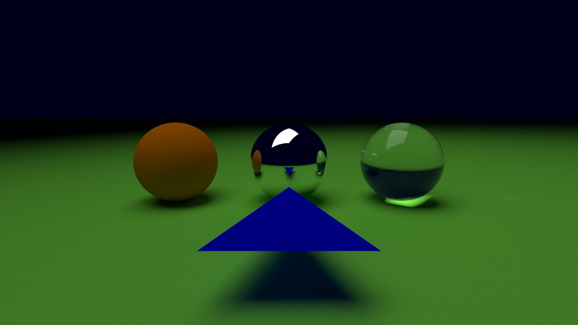
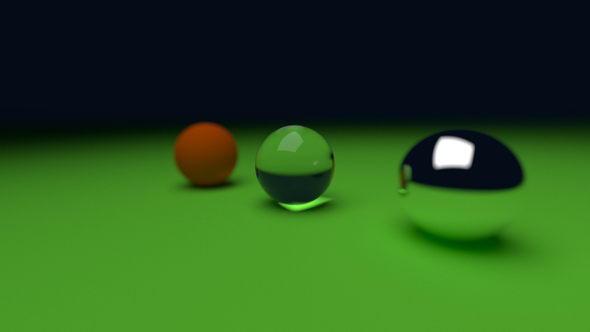

# TRACE-RS
This is yet another ray tracer (with global illumination).
It renders following image in ~15 minutes in the current state of the project with 10k samples/pixel:

And following images in ~5m with 10k samples:

## Rationale
This project is not complete nor correct by any means. It was created for the following purposes:
* learn some Rust,
* it was always one of my "bucket list" project - something I always wanted to do,

## Planned features
* [x] global illumination
* [x] multi-threaded rendering
* [x] importance sampling
* [x] antialiasing
* [x] refraction
* [x] depth of field
* [x] russian roulette
* [ ] textures
* [ ] serialize and deserialize scene (.obj loader)
* [x] spectra rendering (instead of RGB)
* [ ] light dispersion (stretch)

## Known bugs
* ~~occasionally NaN values are return from trace method~~

## Non-goals
* be fast
* be efficient
* model diffraction

## References
* https://github.com/mmp/pbrt-v4
* https://raytracing.github.io/
* https://www.kevinbeason.com/smallpt
* http://www.brucelindbloom.com/
* https://en.wikipedia.org/wiki/Bidirectional_reflectance_distribution_function
* https://en.wikipedia.org/wiki/Lambertian_reflectance
* https://en.wikipedia.org/wiki/Snell%27s_law
* https://en.wikipedia.org/wiki/Fresnel_equations
* https://en.wikipedia.org/wiki/CIE_1931_color_space
* https://en.wikipedia.org/wiki/SRGB
* https://en.wikipedia.org/wiki/Monte_Carlo_integration
* https://refractiveindex.info/
* https://cie.co.at/datatable/cie-1931-colour-matching-functions-2-degree-observer
* https://www.graphics.cornell.edu/online/box/
